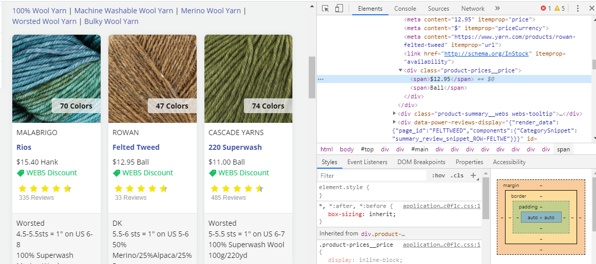
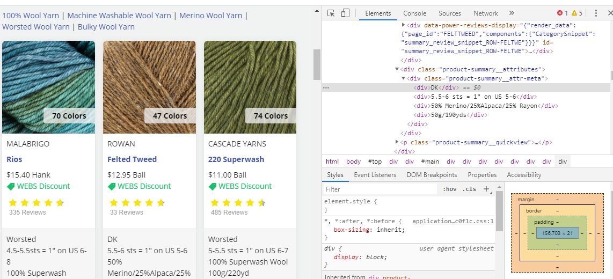
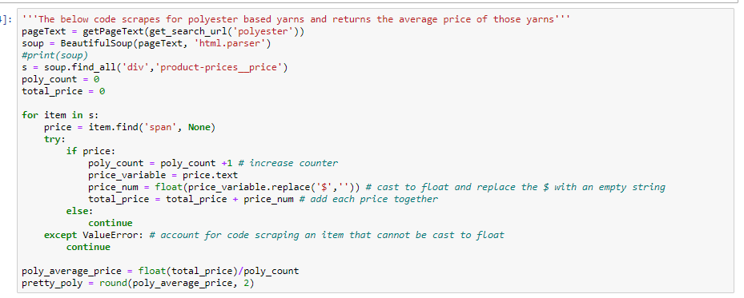
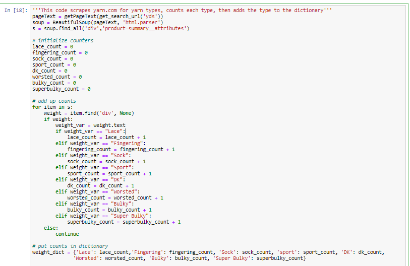
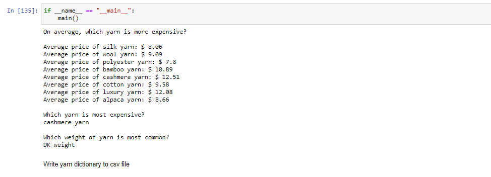

# Final Project

Kayla Bracall DAT 129 - Spring 2020

## Web Scraping Project

This project aims to find which type of yarn is most expensive, and which weight of yarn is most commonly sold. This is done by scraping information from yarn.com. 

The types of yarn that were looked at were:

* alpaca
* bamboo
* cashmere
* cotton
* luxury
* polyester
* silk
* wool

The weights of yarns that were looked at were:

* lace
* fingering
* sock
* sport
* DK
* worsted
* bulky
* super bulky 

## Hypothesis

My hypothesis is that cashmere would be the most expensive yarn material. Based on my own buying habits, I hypothesized that worsted weight yarn would be the most common weight sold. After scraping the site and finding the average price of each type of material, cashmere yarn was fouind to be the most expensive, on average. However, DK weight yarn was found to be the most common weight sold. 

## Process

The first step in the process was to identify the code html elements on yarn.com that will be scraped. 

This screenshot shows the highlighted span element containing the text of the of which our python scrapes to find yarn price.

This screenshot shows the highlighted div element containing the text of the of which our python scrapes to find yarn weight.

The next step was to build code that would scrape for the price of the yarn, and find the average price for that type of yarn. This code block was repeated for each type of yarn.

After finding the average price of yarn, the next step was to scrape for weights of yarn, count the occurence of each weight, then add it to a dictionary.

After this was completed, the next step was to "sort" the dictionary. Since dictionaries are unordered by defnition, this code pulls the dictionary information into a list, sorts that list, then puts the information back into a dictionary sorted. The first value of the dictionary is then displayed to determine the most expensive yarn and the most common weight of yarn sold. 

## Code Output
Code: [FinalProject.ipynb](FinalProject.ipynb)
 

## Limitations

The first limitation that I encountered was determining the average cost of yarn by length. Yarn is often sold in different measurements, with hank, ball, skein all being common. There is no standard length for each of these units. As such, I wanted to find the average price per yard, but was unable to scrape yards from the webpage. If I were to expand this project, I would look further into scraping this information. 

The second limitation was that a lot of yarn is a blend of different materials. This is broken down by percentage on the site. An expansion of this project would also include taking these percentages into account. 

The final limitation of this project was modularity. The finished code has a separate block for scraping each type of yarn. However, I wanted to write a function that could take user input and scrape based on that input. The issue that I ran into was prompting the user to enter all yarn types so that they could all be stored in the yarn dictionary. I experimented with this concept in the file titled 'alt_final_project.py.'  This file breaks the code down into more modularized functions that can be used for more general webscraping. 

## Findings
As expected, the most expensive yarn on average is yarn that is cashmere or contains cashmere. THe most common weight sold on yarn.com is DK weight yarn. 

## Project Expansion
I'd like to expand this project to scrape more than one site online that sells yarn. Doing so would help confirm if the findings in this webscrape project hold true on other sites. Additionally, I'd like to add matplotlib to the code to display some of the data in bar charts. Finally, I'd also like to modularize the code more, create a more robust error log, and take the unit of yarn sold into account. 