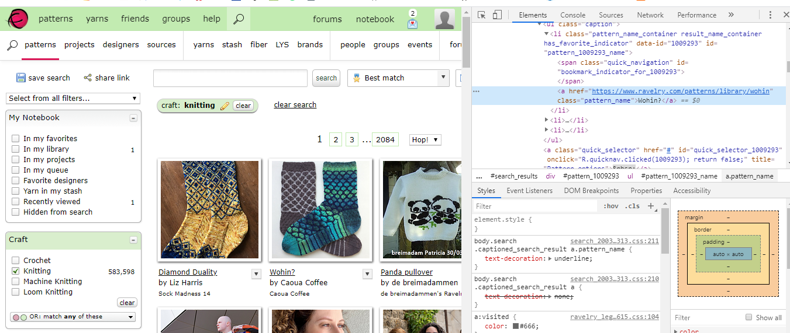

# Screen scraping resources

## Overview 
Companion resource hub for DAT 129 taught at the Community College of Allegheny County. Visit the [mini project guide](https://technologyrediscovery.net/python/mod-scraping.html "Project guide on technologyrediscovery.net") for specifications of our course project. 

## Contents 
*    [Scraping.ipynb](Scraping.ipynb): Scraping example - goodreads.com

## Scraped HTML from ravelry.com
This screenshot shows the highlighted  element containing the text of the of which our python scrapes

 "html viewed in dev tools"
