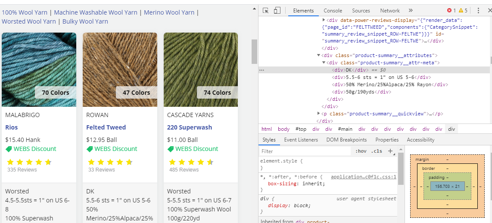

# Web Scraping Project
------------

## Overview
ompanion resource hub for DAT 129 taught at the Community College of Allegheny County. Visit the [mini project guide](https://technologyrediscovery.net/python/mod-scraping.html "Project guide on technologyrediscovery.net") for specifications of our course project. 

In this project, information was scraped from yarn.com. First, a search was performed for wool yarn, then a search for silk yarn. Using python, the average price of silk yarn vs the average price of wool yarn was calculated. The yarn that is currently on average more expensive is displayed. Te most common weight of yarn sold is also displayed. 

## Contents
* Scraping example - goodreads.com: [Scraping.ipynb](Scraping.ipynb)
* HTML 
* Code Output

## HTML from yarn.com
This screenshot shows the highlighted  element containing the text of the of which our python scrapes to find yarn price.

 "html viewed in dev tools"

This screenshot shows the highlighted 
 element containing the text of the of which our python scrapes to find yarn weight.

 "html viewed in dev tools"

## Code Output 

Code: [Bracall_week8_webscraping.ipynb](Bracall_week8_webscraping.ipynb)

Code output:
 "code output viewed in Jupyter Notebook"

